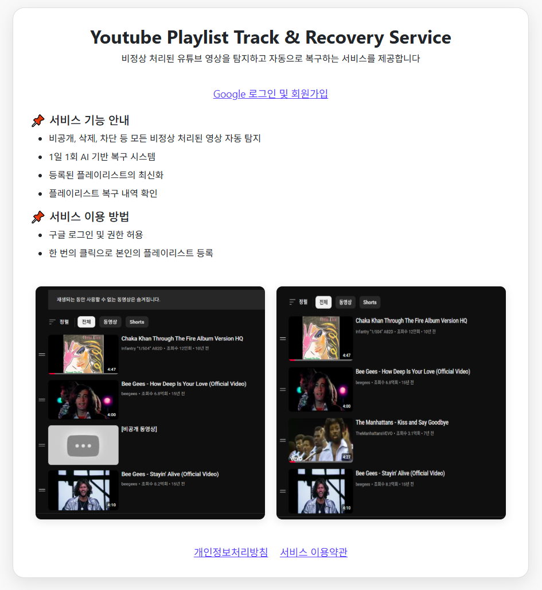
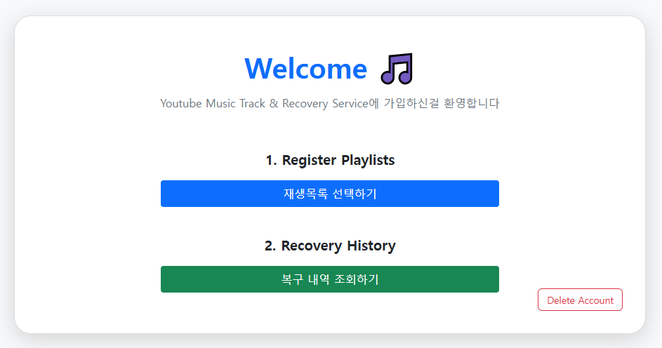
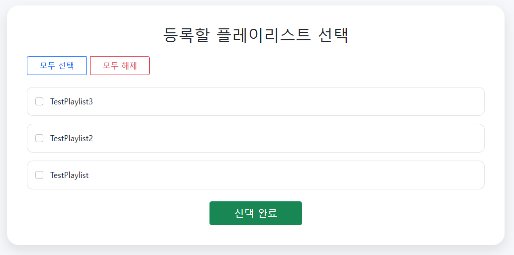

# 🎧 FixMyPlaylist

Youtube 음원 재생목록의 비정상적인 삭제에 대한 **자동 추적 및 복구 서비스**  
유튜브의 재생목록에서 갑작스럽게 사라진 음악들, 이제는 자동으로 복구하세요.

<p align="center">
  
</p>

---

## 📌 1. 프로젝트 소개

### 🔹 프로젝트 명
- **FixMyPlaylist**

### 🔹 서비스 주소
- [FixMyPlaylist 바로가기](https://youtube-track-recovery-71386729441.us-central1.run.app)

### 🔹 시연 영상
- [OAuth 구글 심사 시연 영상](https://www.youtube.com/watch?v=dqOrLUjCFic&t=64s)

---

## 🎯 프로젝트 개요

### 🔸 프로젝트 동기

- 유튜브를 통해 오래전부터 음악 감상


- 가수별로 재생목록을 만들고 음악을 추가하여 관리


- 다음과 같은 이유로 **음원이 사라짐**
  - 업로드자 영상 삭제 / 비공개 전환
  - 채널 삭제
  - 저작권 침해 / 국가 차단 / 기타 접근 제한


- 어떤 음악이 사라졌는지 **식별 불가**


- 수동 스크린샷 백업 → **물리적 한계**

### 🔸 프로젝트 목표

- 재생 불가 음악 자동 식별 및 복구


- 개인뿐만 아니라 **전 세계 유사 사용자**에게도 제공 가능


- **클릭 한 번**으로 재생목록을 등록하면,
  - 음악 저장 및 1일 1회 자동 추적
  - 비정상 처리 시 유사 음원으로 자동 복구
  - **완전 자동화된 서비스 제공**

---

## ❓ 왜 Youtube Music이 아닌가?

- 유튜브 뮤직도 유사한 기능 제공하지만, 다음과 같은 제약 존재:
  - **삭제/비공개 영상은 여전히 제거**
  - **콘서트/라이브/비공식 영상 추가 불가**
  - **자동 리다이렉션(공식 영상으로 대체) 강제**
  - **유튜브 뮤직은 유료 서비스**, 유튜브는 무료

---

## 🛠️ 서비스 이용 방법

1. 구글 계정으로 로그인
2. **최초 로그인 시 OAuth2 권한 요청 승인 (youtube.force-ssl)**
3. 로그인 후 재생목록 추적/복구 대상 재생목록 등록
4. 사용자 관여 없이 **1일 1회 자동 추적 및 복구**
5. 사용자의 재생목록 삭제/수정은 자동 반영

- 추후 기능 확장 예정
  - 단순 추적 및 알림 서비스
  - 자동 복구 서비스

---

## ⚙️ 2. 프로젝트 스펙

- **진행 기간** : 2025.03.04 ~ 진행 중


- **개발자** : 개인 프로젝트


- **개발 환경**
  - Java + Spring Boot
  - DB : Cloud SQL (배포), MySQL (로컬), H2 (테스트)
  - Infra : Google Cloud Run, Cloud Scheduler

### 📁 디렉토리 구조
``` 
 youtubeService
    ├── config
    ├── controller
    ├── domain
    ├── handler
    ├── policy
    │   ├── gemini
    │   └── simple
    ├── repository
    │   ├── musics
    │   ├── playlists
    │   └── users
    ├── scheduler
    └── service
        ├── musics
        ├── playlists
        ├── users
        └── youtube
```

## 🚀 3. 주요 기능

- 비정상 영상 자동 탐지
 

- AI 기반 유사 음원 추출 및 재등록


- 재생목록 상태 추적 및 기록


- 자동화된 복구로 사용자 개입 최소화

<br/></br>
<p align="center">
  
  <br/><br/><br/></br>
  
</p>

---

## 🧩 4. 트러블슈팅 & 기술 과제

- **OAuth2**
  - `@RegisteredOAuth2AuthorizedClient` 사용
  - access/refresh token 처리
  - `access_type`, `prompt`, `scope` 설정 이슈
  - 고유 사용자 식별 및 DB 저장


- **심사 대응**
  - 구글 OAuth2 심사 대응 전략 수립
  - 동의 화면, 개인정보처리방침, 서비스명 일치 검토


- **Youtube 비정상 영상 분류**
  - 삭제/비공개 영상 vs "unavailable video"


- **Persistence & 동기화**
  - JPA 영속성 문제
  - DB cascade vs JPA cascade
  - 플레이리스트 수정 반영 로직


- **보안**
  - CSRF 토큰 관리
  - OAuth 로그인 캐시 이슈

---

## 📡 5. 기술 및 API

- **Youtube Data API V3**
  - 할당량 관리
  - PlaylistItems, Videos, Search API 활용


- **Gemini API**
  - 복구 시 유사 음원 추천에 활용

---

## ✅ 6. 프로젝트 결론 및 리뷰

- 유튜브 사용자의 음악 자산 보호에 실질적 도움을 주는 서비스
- 수작업 백업의 한계를 자동화로 대체
- 실사용자 관점에서의 불편함을 **기술로 해결한 실용적인 예시**

---


